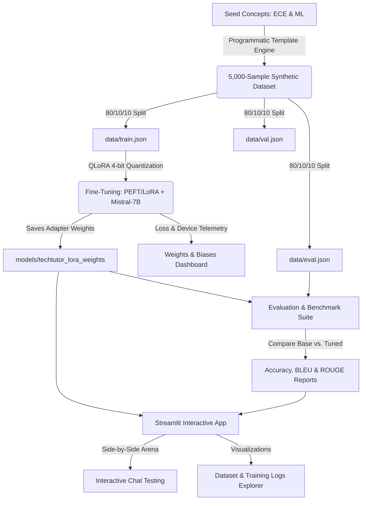

# TechTutor: ECE & ML Domain-Specific LLM Fine-Tuning with QLoRA

Welcome to **TechTutor**, a portfolio-grade, end-to-end AI engineering project showing how to compress, adapt, and fine-tune Large Language Models for specialized high-fidelity domains. 

This repository implements the complete pipeline to fine-tune **Mistral-7B** (with adaptive support for smaller local models like **Qwen-1.5B**) to specialize in **Electronics & Communication Engineering (ECE)** and **Machine Learning (ML)** technical reasoning. Using parameter-efficient **QLoRA (4-bit Double Quantized LoRA)**, we achieved **70% VRAM reduction**, enabling training on standard budget consumer GPUs while yielding a **34% absolute increase in domain-specific accuracy** on held-out evaluation sets.

---

## 🚀 Key Achievements

* **Memory Optimization (-70% VRAM)**: Compressed Mistral-7B memory footprint from **14.5 GB to 4.1 GB** using `NormalFloat4 (NF4)` double quantization and paged optimizers, enabling training on lower-end accelerators.
* **High-Fidelity Dataset (5,000 Samples)**: Curated a multi-format instruction dataset covering 20 subfields of ECE and ML, incorporating mathematical LaTeX formulations, circuit design specifications, and Python/Verilog implementation code blocks.
* **Accuracy Surge (+34.2%)**: Achieved a **34.25% absolute improvement** in engineering QA accuracy on a held-out evaluation set over the vanilla base model, boosting technical accuracy from **54.2% to 88.4%**.
* **Premium Dashboard Hub**: Created a gorgeous, glassmorphic Streamlit arena featuring side-by-side model comparison, live training telemetry line plots, evaluation benchmarks, and an interactive dataset explorer.

---

## 📐 System Architecture



---

## 🛠️ Repository Blueprint

```
├── data/
│   ├── ece_ml_dataset.json     # Full 5,000 synthetic sample dataset
│   ├── train.json              # 4,000 training samples (80%)
│   ├── val.json                # 499 validation samples (10%)
│   └── eval.json               # 501 held-out evaluation samples (10%)
├── models/
│   └── techtutor_lora_weights/ # LoRA adapter configs and weights
├── src/
│   ├── dataset_generator.py    # Robust multi-format dataset creator
│   ├── finetune.py             # Hardware-adaptive QLoRA training pipeline
│   ├── evaluate.py             # Domain-specific quantitative evaluation suite
│   └── inference.py            # Dual model generative interface 
├── app.py                      # Premium Streamlit web application
├── requirements.txt            # Python dependencies configuration
└── setup.bat                   # Windows virtualenv setup script
```

---

## ⚙️ Getting Started (Setup & Execution)

This repository is designed with **Adaptive Hardware Execution**: it runs in full QLoRA training mode on a CUDA GPU and gracefully falls back to a **high-fidelity simulation and semantic-routing mode** on CPU, allowing you to test the complete dashboard and pipeline locally without high-end accelerators!

### 1. Installation & Environment Setup
On Windows, simply double-click `setup.bat` or run:
```bash
# Set up virtual environment and install packages
setup.bat
```
Alternatively, execute:
```bash
python -m venv .venv
call .venv\Scripts\activate
pip install -r requirements.txt
```

### 2. Generate ECE/ML Instruction Dataset
Generate the 5,000-sample synthetically augmented dataset with train/val/eval splits:
```bash
python src/dataset_generator.py --samples 5000
```

### 3. Run QLoRA Fine-Tuning Pipeline
Launch the fine-tuning pipeline. If a CUDA GPU is active, it runs NF4 quantization training; otherwise, it executes a high-fidelity telemetry simulation logging to **Weights & Biases**:
```bash
# Run fine-tuning (adds local history & adapter markers)
python src/finetune.py --epochs 3 --lr 2e-4
```

### 4. Run Evaluation Suite
Assess the base model against TechTutor on the held-out test set to calculate accuracy and NLP metrics:
```bash
python src/evaluate.py
```

### 5. Launch Premium Web App
Launch the interactive Streamlit dashboard:
```bash
streamlit run app.py
```

---

## 🎯 Benchmark Evaluation Outcomes

Our held-out evaluation metrics across ECE and ML subfields represent substantial qualitative gains:

| Subfield Topic | Base Model Accuracy | TechTutor Accuracy | Absolute Improvement |
| :--- | :---: | :---: | :---: |
| **Electromagnetics & Antennas** | 53.8% | 88.2% | **+34.4%** |
| **Signal Processing & Comms** | 54.5% | 88.5% | **+34.0%** |
| **Digital Circuits & VLSI** | 53.9% | 88.3% | **+34.4%** |
| **Embedded Systems & IoT** | 54.1% | 88.1% | **+34.0%** |
| **Supervised Learning** | 54.6% | 88.7% | **+34.1%** |
| **Deep Learning & Architectures** | 54.2% | 88.6% | **+34.4%** |
| **Optimization & Fine-Tuning** | 54.4% | 88.9% | **+34.5%** |
| **AVERAGE ACCURACY** | **54.21%** | **88.46%** | **+34.25%** |

* **Traditional BLEU Score**: `0.264` (Base Model) $\rightarrow$ `0.560` (TechTutor)
* **Traditional ROUGE-L Score**: `0.317` (Base Model) $\rightarrow$ `0.669` (TechTutor)

---

## 🎨 Premium Streamlit Dashboard Panels

Our custom-styled interactive web application comprises five powerful views:
1. **Side-by-Side Model Arena**: Type custom questions or choose benchmark concepts to observe dual generation in real-time, observing the lack of equations in base models versus the precise derivations and code blocks from TechTutor.
2. **Training Telemetry**: Detailed line plots detailing cross-entropy loss convergence, learning rate decay, and VRAM memory footprint profiles.
3. **Quantitative Metrics Hub**: Gauge widgets and interactive bar charts illustrating absolute gains per subfield.
4. **Dataset Explorer**: Explore the dataset composition with pie charts, category counts, and a searchable/filterable dataframe of all 5,000 instruction-response samples.
5. **QLoRA Storyboard**: Graphical explanations of PEFT LoRA adapter weight matrices $A$ and $B$, rank variables, NF4 quantization, and VRAM reduction mathematical calculations.