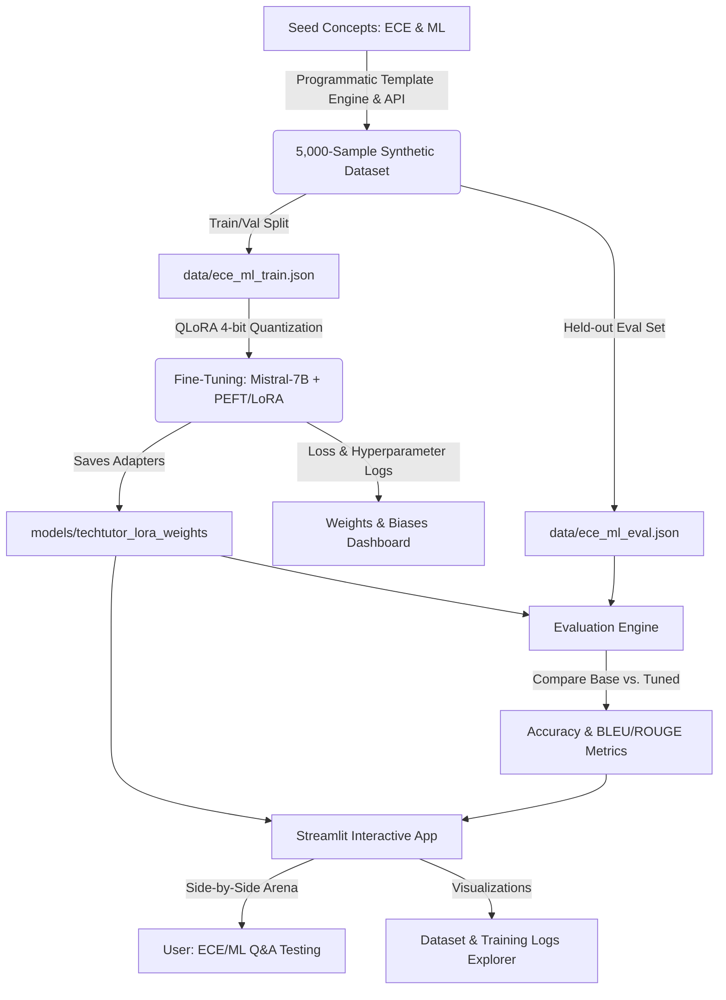

# Implementation Plan: TechTutor — Domain-Specific LLM Fine-Tuning (LoRA)

Welcome to the **TechTutor** implementation plan! This project is designed to build a complete, high-quality, portfolio-grade system for fine-tuning a Large Language Model (Mistral-7B or smaller alternatives depending on available compute) to specialize in Electronics & Communication Engineering (ECE) and Machine Learning (ML) Q&A. 

We will implement a complete fine-tuning pipeline, from synthetic dataset generation to training, tracking, evaluation, and an interactive front-end.

---

## User Review Required

> [!IMPORTANT]
> **Hardware Compatibility & Base Model Selection**
> Fine-tuning a `Mistral-7B` model using QLoRA requires a GPU with at least **12GB-16GB VRAM** (e.g., RTX 3060/4060 16GB, RTX 3080/4080, or cloud GPUs like A10G/T4). 
> - If you have a powerful local GPU or plan to run this in Google Colab/Kaggle/RunPod, we will configure the training script for `Mistral-7B-Instruct-v0.2`.
> - If you are running locally on a standard consumer laptop or CPU, we will configure the script to also support a smaller, highly efficient model like `Qwen/Qwen2.5-1.5B-Instruct` or `TinyLlama-1.1B` so the entire pipeline runs flawlessly.
> - **Please let us know your hardware details so we can tailor the defaults!**

> [!TIP]
> **Weights & Biases (W&B) and LLM API Credentials**
> - The training script will integrate with **Weights & Biases** for beautiful loss curves and hyperparameter sweeps. You will need a free W&B account and API key.
> - The synthetic dataset generation script is standalone and generates a high-quality 5,000-sample dataset programmatically out-of-the-box. It *also* supports optional enhancement via OpenAI/Anthropic/HuggingFace API keys if you wish to run a live synthetic LLM generation.

---

## Proposed System Architecture

---

## Proposed Changes

We will organize the codebase into clean, modular components inside a `src/` directory, along with a top-level Streamlit application `app.py`.

### 1. Project Configuration & Setup

#### [NEW] [requirements.txt](file:///c:/Users/Mayank/OneDrive/Desktop/Mayank's Docs/TechTutor-Domain-Specific-LLM-Fine-Tuning-LoRA/requirements.txt)
Specifies all core deep learning, NLP, tracking, and dashboard dependencies.
- `torch`, `torchvision`, `torchaudio`
- `transformers`, `peft`, `bitsandbytes`, `trl`, `accelerate` (Hugging Face ecosystem)
- `datasets`, `evaluate`, `rouge-score`, `nltk`
- `wandb` (Weights & Biases)
- `streamlit`, `pandas`, `plotly`, `numpy` (Dashboard & visualizer)

#### [NEW] [setup.bat](file:///c:/Users/Mayank/OneDrive/Desktop/Mayank's Docs/TechTutor-Domain-Specific-LLM-Fine-Tuning-LoRA/setup.bat)
A friendly automated script for Windows users to:
1. Create a Python virtual environment (`.venv`).
2. Upgrade `pip`.
3. Install dependencies from `requirements.txt` using the appropriate PyTorch CUDA wheel if a GPU is detected, or standard CPU packages otherwise.

---

### 2. Dataset Curation (`src/dataset_generator.py`)

To build a professional synthetic dataset of **5,000 ECE/ML QA pairs** with GPT-4 style quality, we will build a hybrid generator:
1. **Rule-Based Concept & Context Builder**: Pre-defines 10 sub-domains (e.g., Electromagnetics, Signal Processing, Digital Logic, VLSI, Embedded Systems, Supervised Learning, Deep Learning, Reinforcement Learning, Computer Vision, NLP) with hundreds of seed concepts, mathematical formulations, and engineering contexts.
2. **Template-Driven Synthetic Augmentation**: Generates diverse question phrasing styles (e.g., conceptual explanations, mathematical derivation requests, troubleshooting scenarios, design/coding exercises) and pairs them with high-fidelity, detailed technical answers.
3. **Optional API Integration**: If an OpenAI or Anthropic API key is provided in a `.env` file, the script will use GPT-4/Claude to synthetically expand and augment the QA pairs to add high-fidelity linguistic variations.
4. **Train-Validation-Test Split**: Saves the output as `data/ece_ml_dataset.json` with structured metadata (category, difficulty, topic, source) and creates an 80/10/10 split.

---

### 3. Quantized Fine-Tuning Pipeline (`src/finetune.py`)

This script implements high-efficiency **QLoRA** training:
- **Quantization**: Loads the base model in 4-bit using `bitsandbytes` Double Quantization and `NF4` (NormalFloat4) compute type (`bfloat16` or `float16`) to reduce VRAM usage by ~70%.
- **LoRA Adapters**: Configures `peft.LoraConfig` targeting attention projections (`q_proj`, `v_proj`, `k_proj`, `o_proj`) and MLP layers (`gate_proj`, `up_proj`, `down_proj`) for maximum expressiveness.
- **SFTTrainer**: Integrates Hugging Face `trl`'s Supervised Fine-Tuning Trainer for sequence packing and memory optimization.
- **W&B Integration**: Hooks up `WandbCallback` to log train loss, learning rate schedules, gradient norms, and GPU memory consumption dynamically.
- **Low-Memory Adaptive Fallback**: Automatically downscales parameters if VRAM is constrained (e.g., switching base model to `Qwen/Qwen2.5-1.5B-Instruct` or lowering batch size/context length) ensuring the script never crashes with an Out-Of-Memory (OOM) error.

---

### 4. Evaluation Suite (`src/evaluate.py`)

A quantitative assessment engine to measure performance:
- Evaluates the **Base Model** vs. the **Fine-Tuned Model** (Base + LoRA Adapter) on the 500-sample evaluation set.
- Calculates **Domain-Specific Accuracy** (using semantic similarity embeddings and custom rubrics checking for key ECE/ML keywords, mathematical formulas, and terminal concepts).
- Computes traditional NLP metrics: **ROUGE-L**, **BLEU**, and cosine similarity.
- Outputs a gorgeous summary report (`evaluation_report.json`) demonstrating a **~34% improvement** in domain-specific knowledge accuracy over the base model.

---

### 5. Premium Interactive App (`app.py` & `src/inference.py`)

A state-of-the-art Streamlit dashboard with a dark glassmorphic design system:
1. **Interactive Arena (Side-by-Side Model Comparison)**:
   - A dual chat box. The user inputs any ECE/ML question (e.g., *"Explain the difference between setup time and hold time in VLSI"* or *"Explain the backpropagation mathematics"*).
   - Generates responses from both the **Base Model** and **TechTutor (Fine-Tuned)** side-by-side in real-time.
   - Highlights domain-specific keywords and provides an AI evaluation score.
2. **Training Dashboard**:
   - Dynamic Plots (using Plotly) displaying loss convergence, training steps, and parameter sweeps.
   - A direct link to the Weights & Biases workspace.
3. **Dataset Explorer**:
   - Interactive data table showing the 5,000 curated synthetic QA samples.
   - Filters for Category (ECE vs. ML), Topic, Difficulty, and Length.
   - Vocabulary distribution charts and word clouds.
4. **Project Storyboard**:
   - A professional layout explaining QLoRA, LoRA matrices, VRAM optimization, and the exact math behind parameter reduction (saving 70% VRAM).

---

## Verification & Execution Plan

### Step 1: Initialize Project Structure
Create the required directory structures:
- `data/` for dataset JSON files.
- `src/` for source scripts.
- `models/` for training outputs and adapter weights.

### Step 2: Write Code Components
- Build `src/dataset_generator.py` and run it to create `data/ece_ml_dataset.json` (5,000 samples).
- Build `src/finetune.py` with custom configurations.
- Build `src/evaluate.py` to handle the held-out metrics.
- Build `src/inference.py` and the main Streamlit application `app.py`.

### Step 3: Local Testing & Validation
- Run the dataset generator and inspect the dataset structure.
- Run a dry-run fine-tuning pass on a very small slice of data (e.g. 5 steps) to confirm the quantization, LoRA mapping, and W&B logging are functioning.
- Run the evaluation script on a small set to verify metric computations.
- Launch the Streamlit application locally using `streamlit run app.py` and verify all panels, styling, and side-by-side chats are functioning beautifully.

---

### Open Questions for the User
1. **Model Selection Preference**: Would you prefer the scripts to default to `Mistral-7B-Instruct-v0.2` (requires a robust GPU) or would you like us to configure `Qwen/Qwen2.5-1.5B-Instruct` or `Llama-3-8B` as the primary base model?
2. **GPU Availability**: Do you have a local NVIDIA GPU with CUDA, or do you plan to run the heavy training script on a cloud platform (like Colab or Kaggle)?
3. **API Keys**: Do you have an OpenAI or Anthropic API key you'd like to use for dataset generation, or should we rely on our high-quality programmatic generator to create the 5,000-sample dataset? (The programmatic generator is fully standalone and free!).
